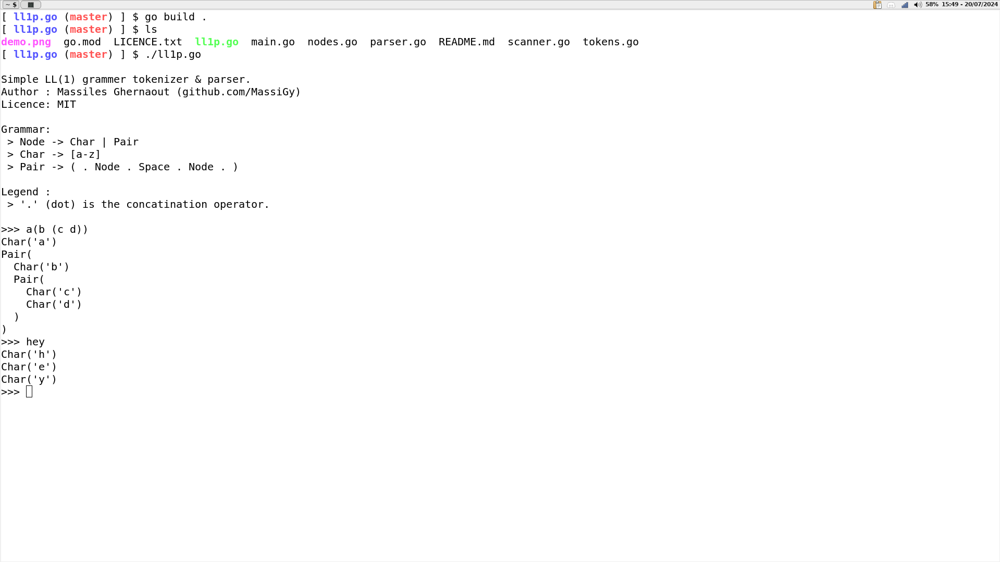

# ll1p.go

This is a simple LL(1) grammar tokenizer & parser written in Go.
LL(1) stands for: 
- **L**eft to right tokenization.
- **L**eftmost token is a terminal token.
- Only **1** peek ahead is necessary for the parsing.

For this project, the grammar/language is simple. It is basically a language that supports pairs with parentheses.

Our grammar is :
 > Node -> Char | Pair

 > Char -> [a-z]

 > Pair -> ( . Node . Space . Node . )

Legend : 
 > '.' (dot) is the concatination operator.

## Demo
